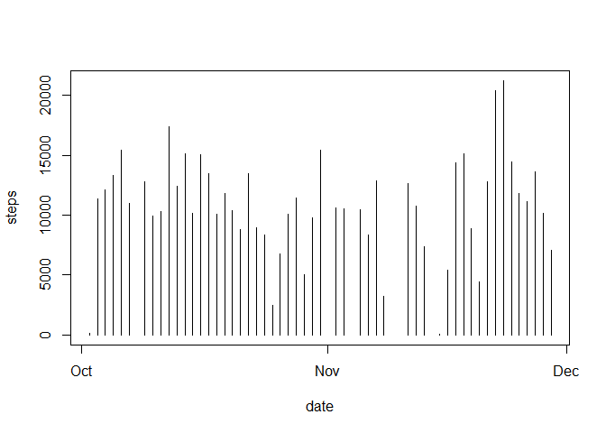
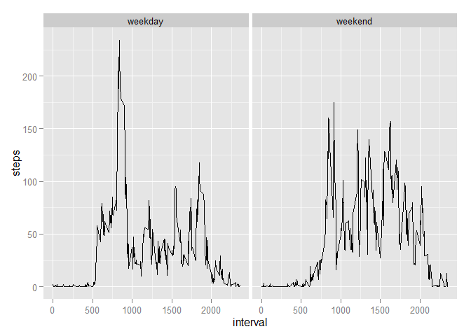

# Reproducible Research: Peer Assessment 1


## Loading and preprocessing the data

Load in the data file from working directory using read.csv

```r
file<-read.csv("c:/Users/stephanie/Documents/GitHub/RepData_PeerAssessment1/activity/activity.csv",header=TRUE,stringsAsFactors=FALSE)
```

Converting date column into POSIXct class for later analysis by mutating date column with as.POSIXct and specifying the date format used. This will make it possible to group by date and easily convert to days of the week.

```r
library(dplyr)
```

```
## 
## Attaching package: 'dplyr'
## 
## The following objects are masked from 'package:stats':
## 
##     filter, lag
## 
## The following objects are masked from 'package:base':
## 
##     intersect, setdiff, setequal, union
```

```r
file2<-mutate(file, date=as.POSIXct(file$date, format="%Y-%m-%d"))
```

## What is mean total number of steps taken per day?

Calculating total steps per day using aggregate with sum

```r
StepsPerDay<-aggregate(steps~date,file2,sum)
```
Making histogram of frequency of steps per day- taking this to mean how often sum of steps happens.

```r
library(ggplot2)
ggplot(data=StepsPerDay)+geom_histogram(aes(x=steps))
```

```
## stat_bin: binwidth defaulted to range/30. Use 'binwidth = x' to adjust this.
```

 
Calulating the Mean and Median of steps per day

```r
mean(StepsPerDay$steps)
```

```
## [1] 10766.19
```

```r
median(StepsPerDay$steps)
```

```
## [1] 10765
```
Mean=10766.19
Median=10765

## What is the average daily activity pattern?
Caculating the average (mean) number of steps taken per intveral over all the days and ignoring NAs. 

```r
StepsPerInterval<-aggregate(steps~interval,file2,mean)
```
plotting the mean steps taken per interval in line plot through ggplot

```r
plot<-ggplot(StepsPerInterval, aes(x=interval, y=steps))
plot+geom_line(linetype=1)
```

 
Finding the interval with the max number of average steps by subsetting on the max value in the steps column

```r
StepsPerInterval[StepsPerInterval$steps==max(StepsPerInterval$steps),]
```

```
##     interval    steps
## 104      835 206.1698
```
Interval with the max average steps is 835
## Imputing missing values
Calculating the number of missing (NA) values in the data set using sum and is.na

```r
sum(is.na(file2$steps))
```

```
## [1] 2304
```
There are 2304 missing values

I can't figure out after 2 nights how to replace the NAs in the data set with the averages so goin to keep working on it but need to turn in this assignment before the deadline so I'm just removing the NAs using complete cases right now.

```r
file3<-file2[complete.cases(file2),]
```
Summing steps taken per day and aking graph of total steps per day using plot

```r
StepsPerDay2<-aggregate(steps~date,file3,sum)
plot(StepsPerDay2$date,StepsPerDay2$steps,type="h",xlab="date",ylab="steps")
```

 
Taking the mean and median as before

```r
mean(StepsPerDay2$steps)
```

```
## [1] 10766.19
```

```r
median(StepsPerDay2$steps)
```

```
## [1] 10765
```
Mean=10766.19
Median=10765
There is not a difference with what I got before.

## Are there differences in activity patterns between weekdays and weekends?

Creating a column with weekdays and then changing that into weekday or weekend

```r
Days<-mutate(file3,Day=weekdays(file3$date))
Days$Day[Days$Day == "Monday"] <- "weekday"
Days$Day[Days$Day == "Tuesday"] <- "weekday"
Days$Day[Days$Day == "Wednesday"] <- "weekday"
Days$Day[Days$Day == "Thursday"] <- "weekday"
Days$Day[Days$Day == "Friday"] <- "weekday"
Days$Day[Days$Day == "Saturday"] <- "weekend"
Days$Day[Days$Day == "Sunday"] <- "weekend"
```

Aggregating mean steps by Day and interval

```r
DaysSteps<-aggregate(steps~Day+interval,Days,mean)
```

Creating panel plot of steps per interval faceted by Days

```r
ggplot(DaysSteps,aes(x=interval, y=steps))+geom_line()+facet_wrap(~Day)
```

 
